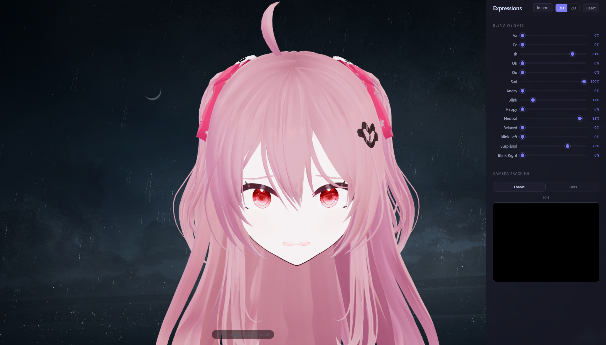
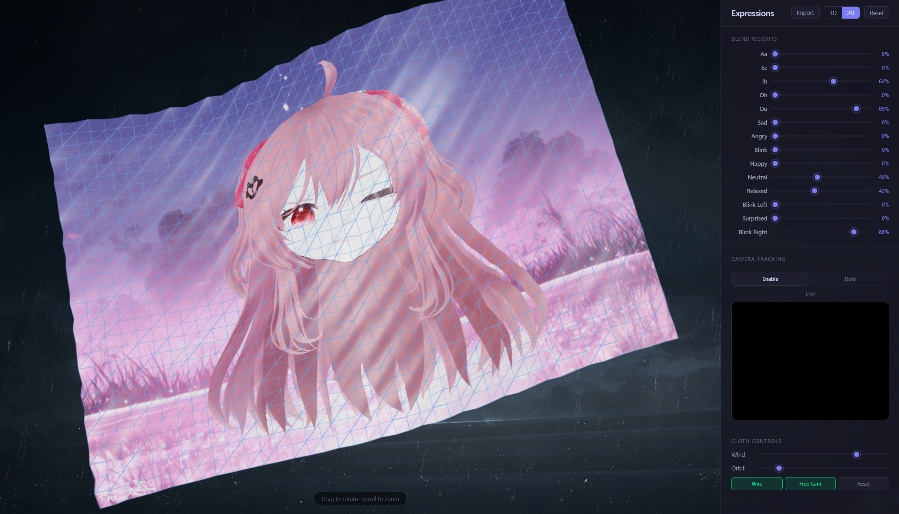

# CG-BlendShape

基于 Web 的 VRM 人脸动画系统，支持实时 blendshape 控制、摄像头面捕、以及"2D 布料"的布料物理 2D 投影模式。

这是本人的计算机图形学课程大作业项目，代码完全由 DeepSeek-V4-Pro 生成，因此难免会有 bugs。Anyway，it works on my machine，这就足够了。

## 功能

- **VRM 模型查看器** — 加载任意 `.vrm` 文件。自动居中面部，隐藏身体 mesh。
- **表达式滑块** — 14 个 blendshape 权重，实时滑块控制。
- **摄像头面捕** — MediaPipe Face Landmarker 实时驱动 VRM 表情。
- **自适应校准** — 开启面捕后前 2 秒采集平静脸基线，后续表情为相对偏差。
- **2D 布料模式** — 将 3D 人脸渲染到 GPU 纹理，投影到质点-弹簧布料网格上。支持风力、点击涟漪、自动环绕相机。
- **特征点叠加** — MediaPipe 478 个面部特征点绘制在摄像头预览上。
- **模型导入** — 运行时切换 `.vrm` 模型。

## 快速开始

```bash
npm install
npm run dev
```

浏览器打开 `http://localhost:3000`，默认 VRoid 模型自动加载。也可点击 **Import** 按钮在运行时加载任意本地 `.vrm` 文件。

## 使用说明

| 控件 | 说明 |
|------|------|
| **Blend Weights** 滑块 | 调整每个表达式的权重（0%–100%） |
| **Import** 按钮 | 加载本地 `.vrm` 模型 |
| **3D / 2D** 切换 | 在 3D 面部视图和布料物理 2D 模式之间切换 |
| **Reset** 按钮 | 清零所有表达式权重 |
| **Camera Tracking** | 启用摄像头面捕。校准期间请保持中性表情 2 秒。 |
| **Dots** 按钮 | 开关摄像头画面上的 MediaPipe 面部特征点 |

### 2D 布料模式控制

| 控件 | 说明 |
|------|------|
| **Wind** 滑块 | 布料表面风力强度 |
| **Orbit** 滑块 | 自动旋转速度 |
| **Wire** 按钮 | 开关网格线框 |
| **Free Cam** 按钮 | 启用手动相机旋转/缩放 |
| **Reset** 按钮 | 恢复布料平面 |
| 点击/拖拽布料表面 | 产生涟漪形变 |

## 技术栈

- **Three.js** — 3D 渲染引擎
- **@pixiv/three-vrm** — VRM 模型加载与表情控制
- **MediaPipe Face Landmarker** — 实时面部网格与 blendshape 检测
- **Vite** — 构建工具

## 架构

```
VRM 文件 → GLTFLoader + VRMLoaderPlugin → vrm.expressionManager
                                                 │
                    ┌────────────────────────────┼────────────────────┐
                    ▼                            ▼                    ▼
              手动滑块控制              摄像头面捕             2D 布料 2D
              setValue(name,w)       MediaPipe → blendshapes   离屏 RenderTarget
                    │                校准 → 重映射 → EMA      布料弹簧物理
                    ▼                            │                    │
              vrm.update()  ◄────────────────────┘                    │
                    │                                                  │
                    ▼                                                  ▼
              GPU morph targets                              clothMat.map = RT
              (顶点着色器混合)                                 风力 + 弹簧
```

### 核心技术要点

**离屏渲染**：`WebGLRenderTarget` 将 VRM 场景渲染为 1024×1024 纹理，全程 GPU 端零拷贝传递给布料材质。

**质点-弹簧系统**：40×30 顶点网格，每个顶点连接 4 邻居。每帧 3 子步欧拉积分：恢复力（胡克定律）→ 弹簧力 → 积分 → 阻尼（0.90）。点击通过 Raycaster 找到命中顶点，向周围顶点注入 Y 轴速度。

**面捕管线**：MediaPipe 52 维 blendshape → 筛选映射到 VRM 14 个表达式 → 自适应基线校准 → 重映射（基线→0, 1.0→1.0）→ EMA 非对称平滑（快攻 0.65 / 慢退 0.25）→ 死区过滤 → 增益放大。

**自适应网格**：进入 2D 模式时根据画布实际像素计算布料物理尺寸，保持物理参数不变。

## 项目结构

```
├── index.html              # 主页面
├── package.json            # 依赖配置
├── vite.config.js          # Vite 配置
├── src/
│   ├── main.js             # 应用逻辑（约 830 行）
│   └── style.css           # 样式
└── public/
    └── assets/
        ├── bg.png           # 网页背景图
        └── foil.png         # 2D 布料星空背景
```

## 依赖

- `three` ^0.170.0
- `@pixiv/three-vrm` ^3.1.0
- `@mediapipe/tasks-vision` ^0.10.18
- `vite` ^6.0.0 (dev)

## 截图





## 资源与鸣谢

| 文件 | 来源 |
|------|------|
| `public/AvatarSample_A.vrm` | VRoid Studio 免费 Demo 模型 |
| `public/assets/foil.png` | [Rune Xiao — pixiv #144796629](https://www.pixiv.net/artworks/144796629) |
| `public/assets/bg.png` | [Rune Xiao — pixiv #137631690](https://www.pixiv.net/artworks/137631690) |

演示中使用了 VRoid Hub 上的 [Evil Neuro-Sama](https://hub.vroid.com/en/characters/1954135249366039447/models/8453217242513942057)。更多免费 VRM 模型可在 [VRoid Hub](https://hub.vroid.com/) 和 [VRM Consortium](https://vrm.dev/) 获取。

## 免责声明

本项目为计算机图形学课程大作业，仅供学习交流使用。如果任何内容侵犯了您的权利，请联系我，我会及时删除。

## License

MIT
